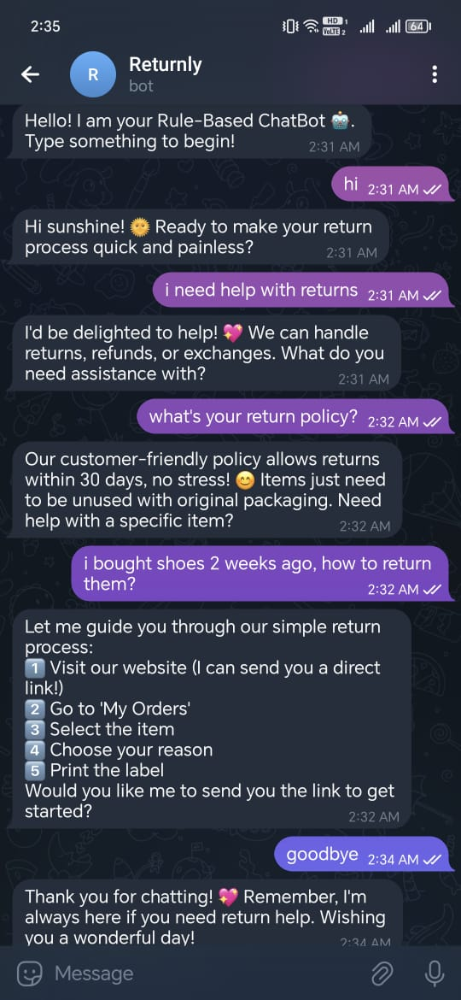

# ReturnlyBot 🤖

<p align="center">
  
</p>

ReturnlyBot is a friendly Telegram chatbot that streamlines the return and refund experience for e-commerce customers through natural, rule-based conversations.

---

## ✨ Features
- 🔁 Instant answers about **returns**, **refunds**, and **exchanges**
- 📦 Handles **damaged or late items** with exception workflows
- 🧠 Includes **30+ pre-defined response templates**
- 💬 Seamlessly integrates with **Telegram** for real-time support

---

## 🚀 Quick Start

### 1. Get Your Telegram Bot Token

1. Open Telegram and search for [**@BotFather**](https://t.me/BotFather)
2. Type `/newbot` and follow the instructions:
   - Choose a display name (e.g., `Returnly Assistant`)
   - Choose a username ending in `bot` (e.g., `ReturnlyHelper_bot`)
3. Copy the API token provided — it looks like this:
123456789:ABCDefGhIJKlmNoPQRstuvWXyz

yaml
Copy
Edit

---

### 2. Set Up and Run the Bot

Open your terminal and run the following:

```bash
# Step 1: Clone the repository
git clone https://github.com/asmaa-2ahmed/ReturlyBot.git
cd ReturlyBot

# Step 2: Create a .env file with your bot token
echo "TELEGRAM_TOKEN=your_token_here" > .env

# Step 3: Install dependencies
pip install -r requirements.txt

# Step 4: Run the bot
python main.py
💬 Example Conversations
You Say	Bot Responds
“How do I return shoes?”	Step-by-step return instructions
“Package arrived damaged”	Initiates replacement process
“Where's my refund?”	Explains refund processing timeline

📋 Requirements
Python 3.8 or higher

Telegram account

Basic terminal usage

📫 Contact
Email: your@email.com
GitHub: asmaa-2ahmed/ReturlyBot

yaml
Copy
Edit

---

### ✅ Updates:
- ✅ **Image resized** using HTML (`width="600"`) so it's centered and not oversized
- ✅ **Setup steps** formatted for easy copy-pasting (especially in terminal)
- ✅ Clear **bot token instructions** for beginners

Let me know if you want this as a downloadable `README.md` file or if you’d like to include a GIF or deployment instructions!


